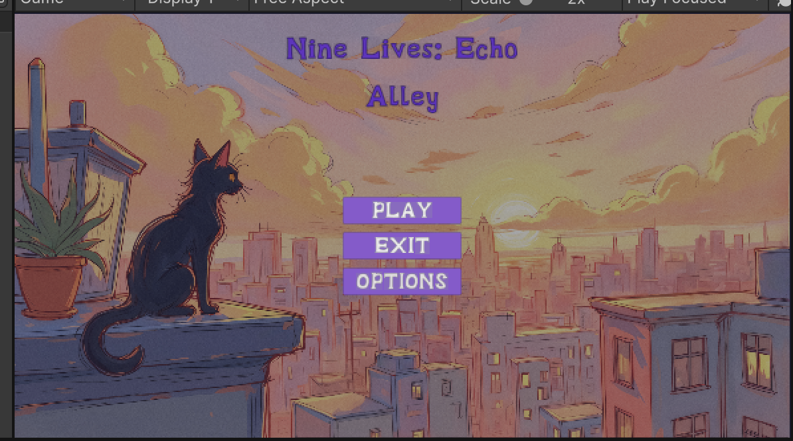
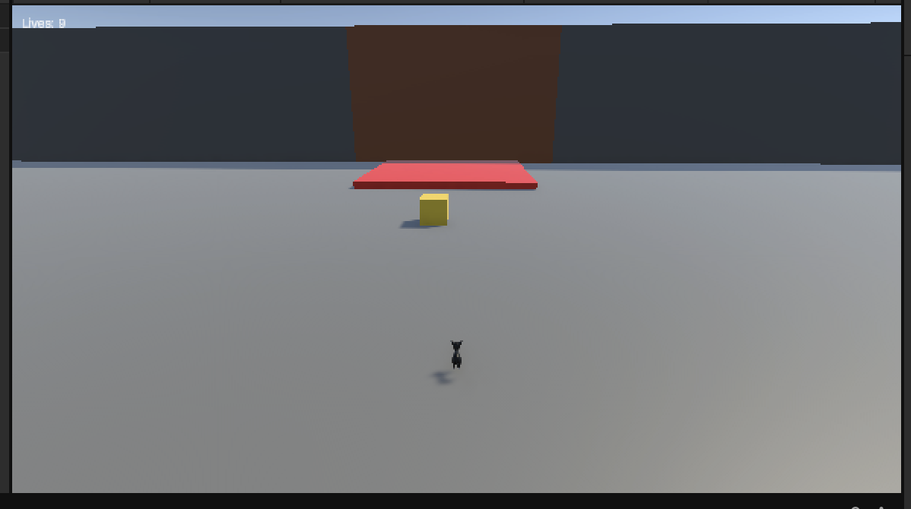
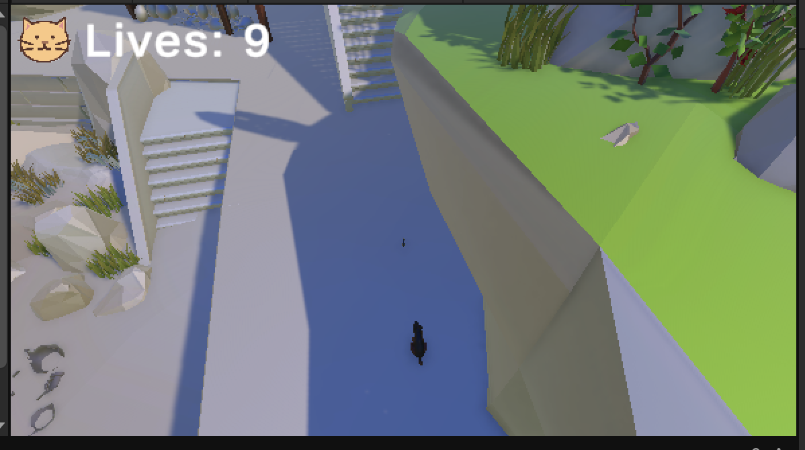
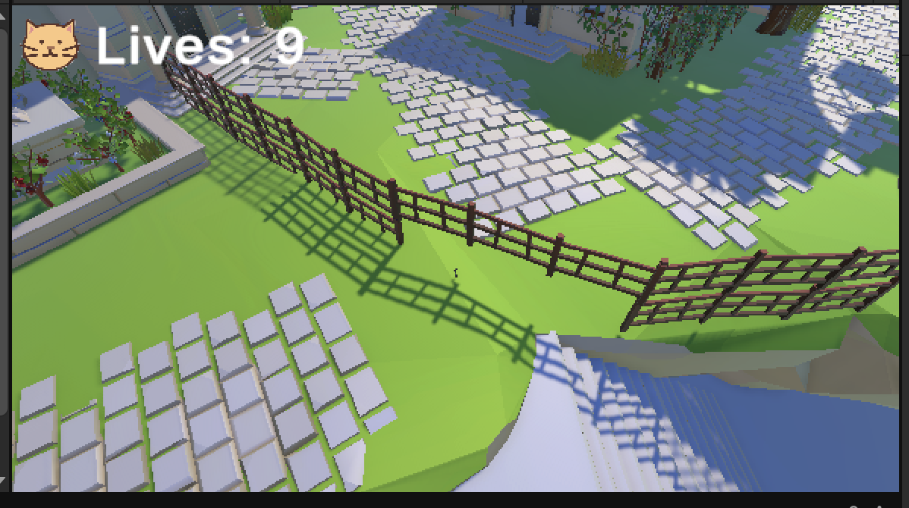

  
  <h1>Nine Lives: Echo Alley</h1>
  
  

    A puzzle-stealth game where each life becomes a ghost that helps solve the level.
  

  
  

---

# Table of Contents

- [Repository](#-repository)
- [Game Description](#-game-description)
- [X-Factors](#-x-factors-core-innovations)
- [Screenshots](#-screenshots)
- [Team](#-Team:-Nine-Lives-Devs)
- [Organization & Responsibilities](#-group-organization--responsibilities)
- [Project Status](#-project-status-midway-review)
- [Anticipated Challenges](#-anticipated-challenges--assistance-needed)
- [Contact](#-contact)

---

# Repository
https://github.com/nancicardenas/FinalGroupProject

---

# Game Description

**Nine Lives: Echo Alley** is a puzzle-stealth game where the player controls a cat navigating an environment using all nine of its lives as a core gameplay mechanic. Each time the player dies or manually resets, that attempt is recorded and replayed as a ghost in the next run. These ghost cats repeat previous actions and can be used to distract enemies, deactivate traps, and solve environmental puzzles.

The gameplay emphasizes planning and coordination across multiple lives rather than traditional combat or simple avoidance. Players build a solution over multiple attempts, turning failure into a strategic advantage. This creates emergent gameplay situations where timing, positioning, and interaction between ghosts, enemies, and the environment are key to progression.

This project incorporates course concepts including **state machine AI behavior, custom shaders, interaction systems, animation control, UI design, and structured code organization**. The ghost replay mechanic and NPC systems combine to create dynamic, non-linear gameplay.

---

# X-Factors (Core Innovations)

- **Ghost Replay System**
  - Each life becomes a replayable “ghost”  
  - Enables multi-agent puzzle solving
  - If dog detects ghosts, the ghosts will disappear
  - If ghosts walk into traps, the ghost will disappear
  - Ghosts will include a ghost effect shader

- **Emergent Gameplay**
  - Player + ghosts + enemies interact dynamically
  - Patrol + chase 
  - No fixed solutions  

- **NPC State Machine AI**
  - Enemies operate using state machines (patrol, chase, playerCaught)  
  - React to player, environment, and ghost echoes
  - Dog enemies will patrol certain points on the map
  - If the player is within a certain distance it will be alerted and start chasing player

- **Multi-Life Strategy System**
  - Failure becomes part of the solution  
  - Encourages planning across multiple runs
  - Strategically use ghost cats to avoid enemies or go over traps 

- **Custom Ghost Shaders**
  - Different shaders for each ghost replay
  - Visual effects (possibly glitching or waves)

---

# Screenshots

 
  
  
  
  
  

---

# Team: Nine Lives Devs

Nine Lives Devs is a collaborative game development team focused on building systems-driven gameplay experiences through iterative design and technical integration. For Nine Lives: Echo Alley, the team is developing a puzzle-stealth game centered around a unique multi-life replay mechanic, where each failure contributes to future success.

---
# Organization & Responsibilities

Each member is responsible for their system and must understand how it integrates into the full game.

---

## Jordan Spencer – Ghost Mechanics & Lives

- [x] Life system (9 lives)
- [x] Death/reset system
- [x] Record player actions
- [x] Ghost replay system
- [x] Multi-ghost support (8 max = death on 9th life)
- [x] Reset clearing logic
- [ ] Interaction replay
- [ ] Differentiate ghosts with shaders

---

## Noah – Gameplay & Interaction

- [x] Movement (WASD)
- [x] Run (Shift)
- [x] Jump (Space)
- [ ] Idle animations (2 states)
- [x] Interaction (Left Click)
- [x] Manual reset (Right Click)
- [ ] Key system
- [ ] Gate system
- [ ] Win/lose conditions

---

## Dylan Rambo – Enemies & AI

- [x] NPC state machine system
- [x] Dog AI (patrol, chase)
- [ ] Human AI (alert, detection)
- [x] Detection systems
- [x] Interaction with ghosts
- [ ] Balance enemy behavior

---

## Nanci Cardenas – Level Building & UI

- [x] Title screen (Play, Options, Exit)
- [ ] Options menu (sound slider)
- [ ] Cat selection
- [ ] Tutorial level
- [x] Key, gate, trap placement
- [ ] UI prompts
- [ ] Scene transitions
- [x] Sound effects (no music)

---

# Project Status

**Current Phase:** Prototype

### Completed
- [x] Repository created  
- [x] Roles assigned  
- [x] Game concept finalized
- [x] Player controller  
- [x] Interaction system  
- [x] Ghost system
- [x] README

### In Progress
- [ ] Level Design
- [ ] Key, gate, trap placement for level 1
- [ ] Scene transition from tutorial to level 1
- [ ] Game Ending
- [ ] Human AI interaction
- [ ] Level interactables
- [ ] UI flow
- [ ] Cat Selection

---

# Anticipated Challenges / Assistance Needed

- Ghost replay synchronization 
- Custom shader design/implementation
- Interaction consistency across runs  
- Reset reliability  
- NPC state machine implementation  
- Animation integration
- Handling emergent situations with/from the AI

---

# Contact

- Jordan Spencer: https://github.com/[jordan-nicholas-spencer]

- Dylan Rambo: https://github.com/[dylanrambo26]

- Nanci Cardenas: https://github.com/[nancicardenas]

- Noah: https://github.com/[NoamJ2004]
